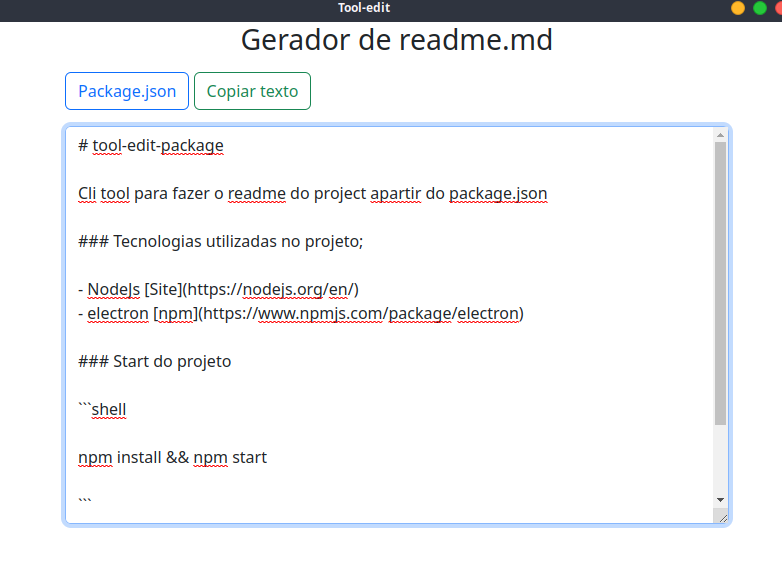

# Tool-edit-package

Cli tool para fazer o readme do project apartir do package.json

### Tecnologias utilizadas no projeto;

- NodeJs [Site](https://nodejs.org/en/)
- electron [npm](https://www.npmjs.com/package/electron)

### Start do projeto

```shell

npm install && npm start

```

### Imagens


